# SAVIS Architecture

This document describes SAVIS using the C4 model:

- **Level 1 - System Context**: who uses SAVIS and which external systems it
  interacts with.
- **Level 2 - Containers**: deployable applications and infrastructure.
- **Level 3 - Components**: important modules inside each container.
- **Dynamic views**: runtime flows that cross container boundaries.

SAVIS is the back-office system for SavouretPlus. It currently supports BOMs,
provider offers, activity rates, sellable catalog products, product cost
analysis, and asynchronous offer collection. Future slices include orders,
inventory, purchasing, catering, decoration operations, and broader margin
reporting.

## Diagram Conventions

Each diagram states its C4 abstraction level. Labels explicitly identify
people, software systems, containers, or components. Mermaid `flowchart`
syntax is used for portable rendering, while sequence diagrams provide
supplementary dynamic views. Code-level diagrams (C4 Level 4) are intentionally
omitted because the code is still evolving and those details are better kept in
source and tests.

## Architectural Drivers

- Keep Java as the source of truth for SAVIS business state.
- Keep provider acquisition outside request handlers because scraping is slow,
  unstable, and retryable.
- Keep Catalog independent from BOM internals; Catalog references BOMs by UUID
  and uses a public BOM pricing API.
- Keep Supabase as a public projection, not the product system of record.
- Organize code by vertical slices and enforce inward dependencies through
  domain objects, use cases, ports, and adapters.

## C4 Level 1 - System Context

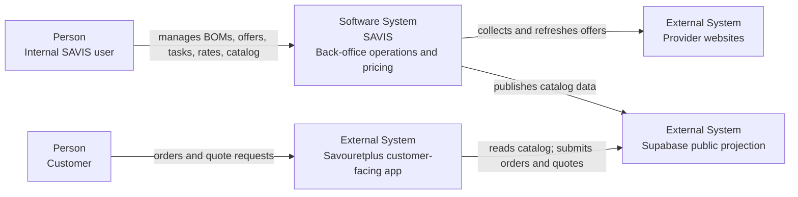

### Context Notes

- **SAVIS Admin** is internal. It is not the public storefront.
- **SAVIS API** owns business concepts: BOM, Supply, Activity Rate, Catalog.
- **SAVIS Executor** owns external provider acquisition and executor tasks.
- **Supabase** exposes public commerce-facing data to Savouretplus.
- Provider websites are volatile external dependencies and must not leak into
  Java domain models.

## C4 Level 2 - Container View

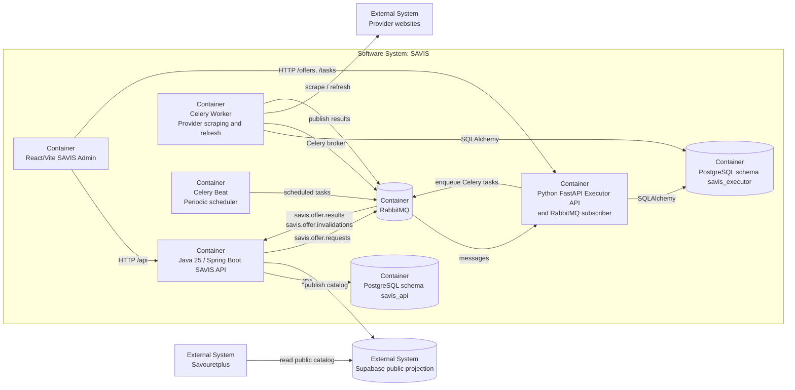

### Container Responsibilities

| Container            | Responsibility                                                                        | Persistence                        |
| -------------------- | ------------------------------------------------------------------------------------- | ---------------------------------- |
| `savis-admin`        | Internal UI for BOMs, offers, tasks, activity rates, categories, and catalog products | Browser state only                 |
| `savis-api`          | Business workflows and source of truth for BOM, Supply, Catalog, Activity Rate        | PostgreSQL schema `savis_api`      |
| `savis-executor` API | Executor HTTP API and lightweight RabbitMQ subscriber                                 | PostgreSQL schema `savis_executor` |
| Celery worker        | Slow provider collection and offer refresh                                            | PostgreSQL schema `savis_executor` |
| Celery Beat          | Due-offer refresh and stale-task cleanup scheduling                                   | Celery broker state                |
| RabbitMQ             | Offer request/result transport and Celery broker                                      | Broker queues                      |
| Supabase             | Public catalog, customer order, and quote-request projection                          | Supabase PostgreSQL                |

## C4 Level 3 - SAVIS API Components

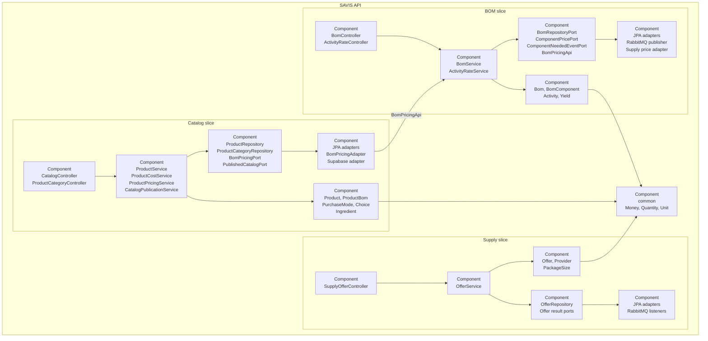

### API Component Rules

- Domain objects contain business rules and avoid framework dependencies.
- Use cases coordinate validation, persistence, pricing, messaging, and
  publication.
- Ports express dependencies needed by use cases.
- Adapters implement web, persistence, messaging, external integration, and
  cross-module access.
- Catalog does not depend on BOM persistence or entities. It uses
  `BomPricingPort`, implemented by `BomPricingAdapter`, which calls the public
  BOM `BomPricingApi`.

## C4 Level 3 - SAVIS Executor Components

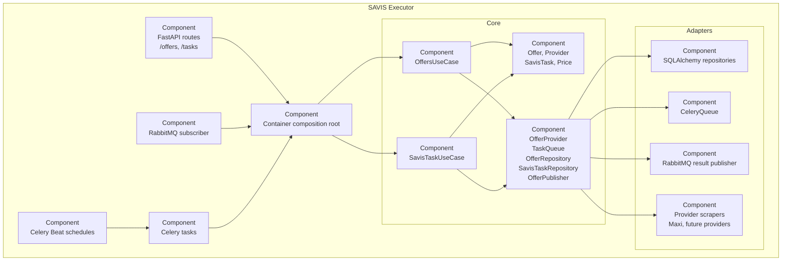

### Executor Component Rules

- Core models and use cases are provider-neutral.
- Provider-specific selectors, parsing, Playwright behavior, and HTML handling
  live under scraper adapters.
- HTTP routes and RabbitMQ callbacks only validate, translate, and enqueue.
- Celery executes slow and retryable work.
- Failed Celery tasks are reported to executor task persistence through
  `ReportingTask`.

## C4 Level 3 - SAVIS Admin Components

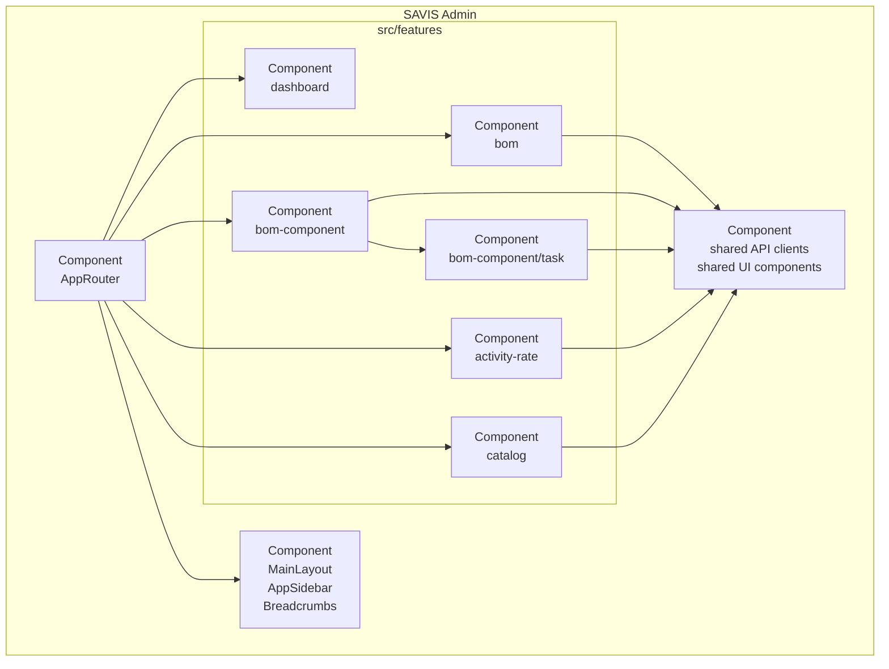

### Admin Routes

| Route                   | Feature                  |
| ----------------------- | ------------------------ |
| `/dashboard`            | dashboard                |
| `/boms`                 | BOM list                 |
| `/boms/add`             | BOM creation             |
| `/boms/:id`             | BOM editing              |
| `/bom-components`       | reviewed provider offers |
| `/bom-components/tasks` | executor task monitoring |
| `/activity-rates`       | global hourly rates      |
| `/catalog-products`     | product catalog          |

Executor tasks are colocated under `bom-component/task` because they are a
technical detail of retrieving and refreshing BOM component offers.

## Dynamic View - BOM Offer Collection

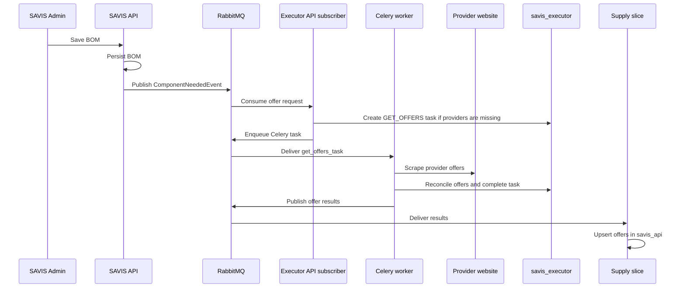

## Dynamic View - Manual Retrieval and Offer Review

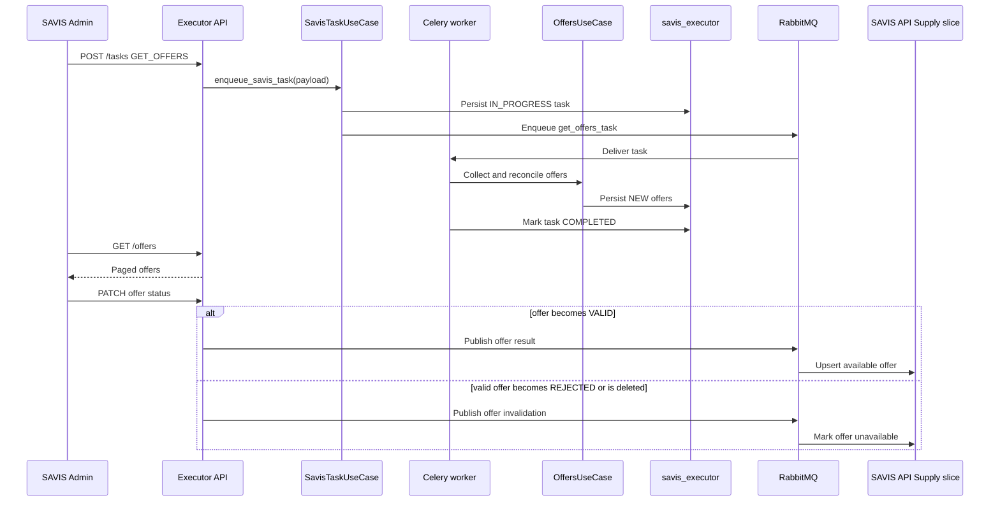

Task creation may return a conflict when all configured providers already have
offers for the requested search term and component type.

## Dynamic View - Scheduled Offer Refresh

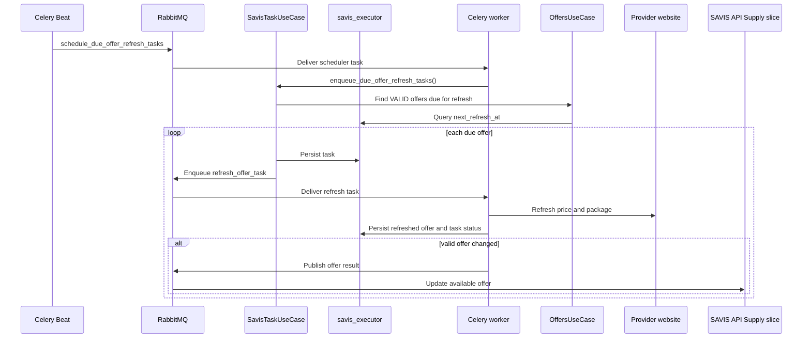

The refresh frequency determines `next_refresh_at`. A successful refresh only
publishes back to Java when the persisted valid offer's price or package size
changed.

## Dynamic View - Activity Rate Configuration

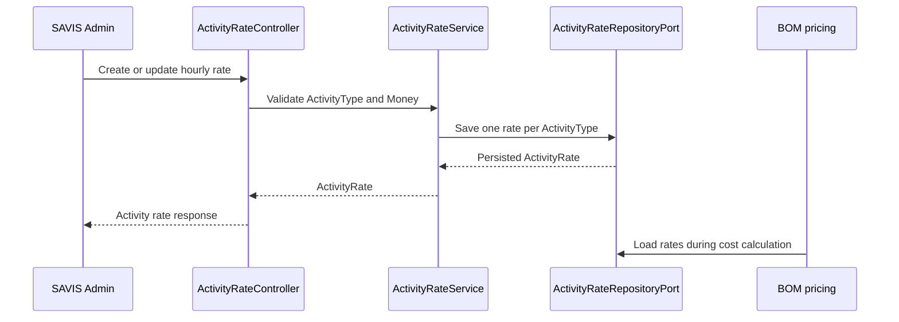

Activities store their type and duration. They do not copy the hourly rate;
changing a configured rate affects subsequent BOM cost calculations.

## Dynamic View - Catalog Product Management

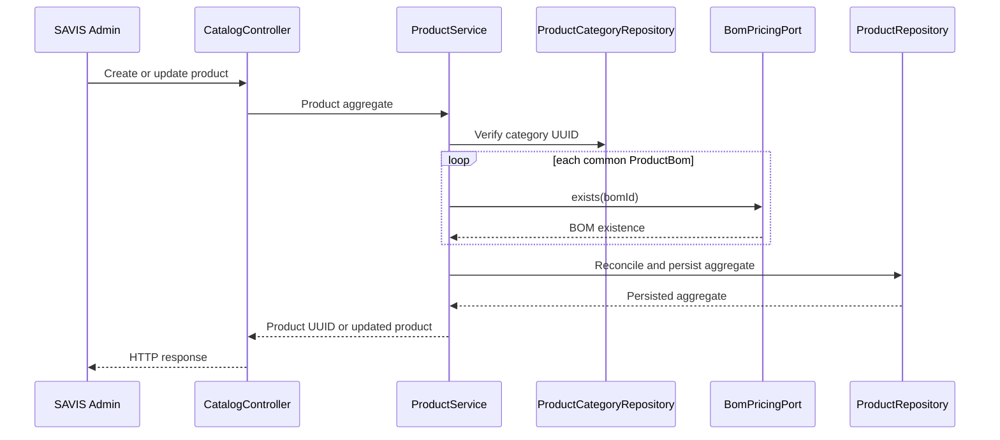

Unknown common Product BOMs reject create/update. Choice and ingredient BOM
references remain optional so an incomplete cost model does not block product
management or sale.

## Dynamic View - Catalog Pricing

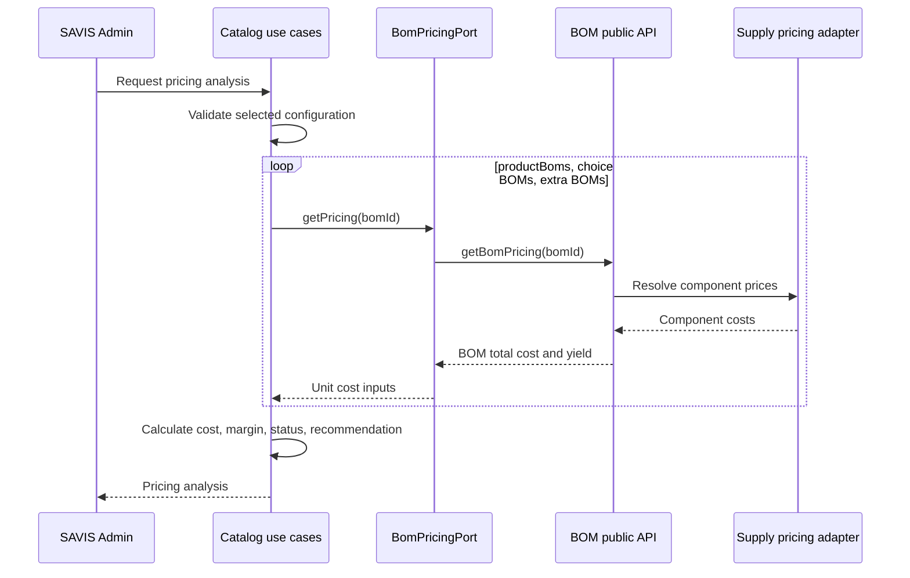

Pricing analysis never changes sale prices. It returns margin health and a
recommended price for human review.

## Dynamic View - Catalog Publication

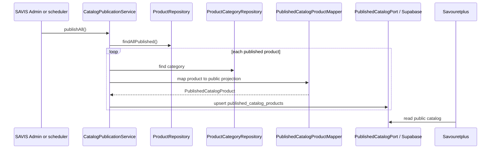

The public projection excludes common `productBoms`, internal costs,
target-margin data, diagnostics, and recommended prices. Choice and ingredient
`bom_id` values may be present because the customer configuration can require
them.

## Dynamic View - Executor Retry and Scheduling

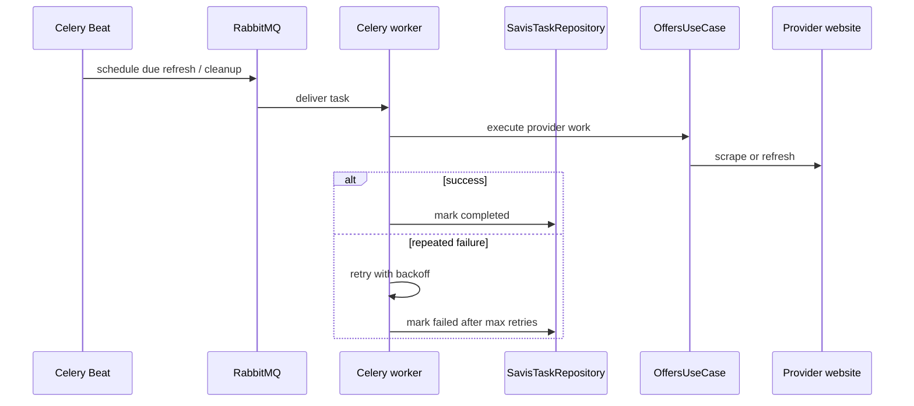

RabbitMQ subscriber callbacks use `basic_ack` only after enqueueing succeeds.
Malformed or unprocessable messages currently use `basic_nack(requeue=false)`;
a dead-letter queue is a future hardening step.

## Persistence Ownership

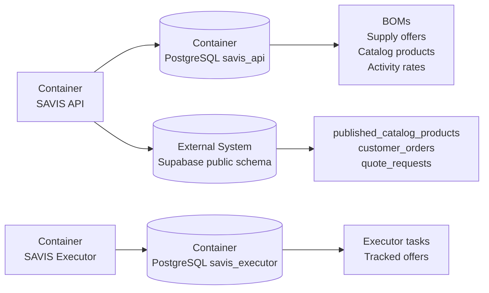

- Java-owned schema changes currently use `spring.jpa.hibernate.ddl-auto=update`.
- Java tests use H2 in PostgreSQL compatibility mode with `ddl-auto=create-drop`.
- Executor schema is created by SQLAlchemy at runtime.
- Supabase schema is managed by SQL migrations under `supabase/migrations`.
- BOM references across Catalog remain UUID values, not JPA foreign keys to BOM
  entities.

## Code Organization

### Java API

```text
com.savouretplus.savis
  bom/
    api/
    domain/
    usecase/
    port/
    adapter/
    config/
  supply/
    api/
    domain/
    usecase/
    port/
    adapter/
    config/
  catalog/
    domain/
    usecase/
    port/
    adapter/
    config/
  common/
```

### Executor

```text
app/
  core/
    models.py
    ports.py
    use_case_offers.py
    use_case_savis_tasks.py
  adapters/
    api/
    celery/
    database/
    rabbitmq/
    scrapers/
  container.py
```

### Admin

```text
src/
  app/
  features/
    activity-rate/
    bom/
    bom-component/
      task/
    catalog/
    dashboard/
  shared/
```

## Architectural Rules

- Keep domain/core models framework-independent.
- Keep cross-module dependencies explicit through ports or public APIs.
- Keep provider scraping isolated behind executor `OfferProvider` adapters.
- Keep Java as owner of business state.
- Keep Python as owner of acquisition execution and task state.
- Keep Supabase as a projection, not the source of truth.
- Do not run provider collection synchronously in request handlers or RabbitMQ
  callbacks.
- Keep result consumers idempotent because messages may be retried or replayed.
- Do not introduce Catalog-to-BOM JPA relationships.
- Treat pricing recommendations as advisory; never auto-update sale prices.
