# SAVIS Architecture

This document describes the current architecture of SAVIS using C4-style
system, container, component, and dynamic views.

It focuses on ownership, dependencies, runtime behavior, persistence, and
delivery. Setup instructions and feature details belong in the
[root README](../README.md) and module documentation.

## Navigation

- [Scope](#scope)
- [Architectural Drivers](#architectural-drivers)
- [Architecture Used in SAVIS](#architecture-used-in-savis)
- [System Context](#system-context)
- [Container View](#container-view)
- [Production Topology](#production-topology)
- [API Components](#api-components)
- [Executor Components](#executor-components)
- [Admin Components](#admin-components)
- [Runtime Flows](#runtime-flows)
- [Data Ownership](#data-ownership)
- [Messaging](#messaging)
- [Operational Characteristics](#operational-characteristics)
- [Delivery Architecture](#delivery-architecture)
- [Architectural Rules](#architectural-rules)
- [Known Constraints](#known-constraints)

## Scope

SAVIS is the internal back-office system for SavouretPlus. It currently owns:

- technical BOMs, components, activities, yields, and costs;
- provider offer acquisition and review;
- global activity rates;
- sellable catalog products and configuration rules;
- product cost and margin analysis;
- publication of a limited customer-facing catalog projection.

The public SavouretPlus application and Supabase commerce tables are outside
the SAVIS system boundary. SAVIS publishes catalog data to Supabase but does
not use Supabase as its business database.

Orders, inventory, purchasing, catering operations, and decoration operations
are not yet SAVIS business slices.

### Diagram Conventions

The diagrams use Mermaid for rendering in GitHub. C4 Level 4 code diagrams are
intentionally omitted because package and class details are better represented
by source code and automated module tests.

## Architectural Drivers

1. **Clear ownership**

   Java owns business state. Python owns acquisition execution and provider
   state. Supabase owns only the public projection and customer submissions.

2. **Asynchronous provider access**

   Scraping is slow, externally constrained, and failure-prone. HTTP handlers
   and RabbitMQ callbacks persist and enqueue work instead of performing it.

3. **Persistent browser identity**

   Google Chrome runs outside Docker and Celery so its profile, cookies, local
   storage, and browser identity survive task and container restarts.

4. **Explicit module boundaries**

   Business slices communicate through public APIs and ports. Catalog never
   accesses BOM entities or repositories directly.

5. **Independent schema evolution**

   The API, Executor, and Supabase each own their migrations and persistence
   lifecycle.

6. **Operationally verifiable releases**

   Production uses immutable image digests, ordered migrations, dependency
   health checks, and a checksummed release package.

## Architecture Used in SAVIS

SAVIS is built as a modular monolith plus a separate acquisition executor.
The API keeps business modules in one deployable Spring Boot application, while
the Executor isolates provider access, browser automation, and Celery work.

The main architectural patterns used are:

| Pattern                                      | Where it appears                                                                                                                                             | Purpose                                                                                                                                                                        |
| -------------------------------------------- | ------------------------------------------------------------------------------------------------------------------------------------------------------------ | ------------------------------------------------------------------------------------------------------------------------------------------------------------------------------ |
| Modular monolith                             | SAVIS API modules: BOM, Supply, Catalog, Common                                                                                                              | Keep business slices independently understandable while sharing one JVM, one deployment unit, and in-process module calls.                                                     |
| Spring Modulith module verification          | `SavisApiModularityTests` and named interfaces                                                                                                               | Enforce allowed module dependencies and document the module graph.                                                                                                             |
| Hexagonal architecture / ports and adapters  | API use cases depend on repository, pricing, publication, and messaging ports; Executor use cases depend on repository, queue, publisher, and provider ports | Keep domain/use-case code independent from HTTP, JPA, RabbitMQ, Supabase, provider HTML, and browser automation details.                                                       |
| Domain-driven tactical patterns              | Aggregates such as BOM and catalog Product; value objects such as Money, Quantity, Unit                                                                      | Put business invariants and calculations close to the model that owns them.                                                                                                    |
| Repository pattern                           | JPA repositories in the API and SQLAlchemy repositories in the Executor                                                                                      | Hide persistence mechanics behind module-specific persistence adapters.                                                                                                        |
| Application service / use-case orchestration | `BomService`, `OfferService`, catalog services, Executor use cases                                                                                           | Coordinate validation, persistence, pricing, messaging, and external ports without pushing workflow into controllers.                                                          |
| Adapter pattern                              | Web controllers, RabbitMQ listeners/publishers, Supabase adapter, provider adapters                                                                          | Isolate protocol-specific and vendor-specific code at the edges.                                                                                                               |
| Facade / public module API                   | `BomPricingApi`, `SupplyApi`                                                                                                                                 | Allow one module to consume another module's capability without depending on its entities or repositories.                                                                     |
| Event-driven integration                     | RabbitMQ offer request, result, and invalidation messages                                                                                                    | Decouple the API from slower provider acquisition and allow asynchronous processing.                                                                                           |
| Outbox pattern                               | Spring Modulith event publication table `event_publication` for API events externalized to RabbitMQ                                                          | Persist event publication state with the API transaction so outbound integration messages are traceable and retryable instead of being fire-and-forget `RabbitTemplate` sends. |
| Declarative event externalization            | `@Externalized` on `ComponentNeededEvent` and Modulith AMQP externalization                                                                                  | Declare which application events leave the module boundary and map domain events to RabbitMQ contracts in one place.                                                           |
| Message contract mapping                     | `ComponentNeededEvent` maps to the RabbitMQ payload `{content,type}`                                                                                         | Preserve external wire compatibility while allowing the Java domain event to keep domain-oriented names.                                                                       |
| Durable broker topology                      | Durable RabbitMQ queues, direct exchange, and queue bindings                                                                                                 | Keep broker routes stable across restarts and avoid coupling publishers directly to queue declaration details.                                                                 |
| Task queue / worker pattern                  | Celery tasks and RabbitMQ delivery in the Executor                                                                                                           | Run slow browser/provider operations outside request and subscriber callbacks.                                                                                                 |
| Scheduled jobs                               | Celery Beat executor workflows                                                                                                                               | Run refresh and cleanup workflows on explicit schedules.                                                                                                                       |
| Circuit breaker / provider protection        | Executor provider access policy cooldowns                                                                                                                    | Reduce repeated requests when a provider blocks or becomes unhealthy.                                                                                                          |
| Retry with backoff and stale cleanup         | Celery retry policy, hard task limits, and scheduled stale task cleanup                                                                                      | Recover from transient failures while making stuck work visible and terminal.                                                                                                  |
| Read model / projection                      | API Supply offer projection and Supabase published catalog projection                                                                                        | Store query-friendly views owned by the consumer boundary rather than sharing internal aggregates.                                                                             |
| Health check and readiness gates             | API, Executor, RabbitMQ, PostgreSQL, Chrome relay, deployment script                                                                                         | Promote releases only after dependencies and application components are operational.                                                                                           |

These patterns are intentionally not applied uniformly everywhere. The system
uses the heavier event/outbox path where cross-process messaging must be
transactionally traceable, and keeps direct in-process APIs for synchronous
module calls such as catalog pricing.

## System Context

### C4 Level 1

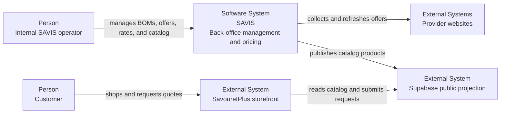

### System Boundaries

| System            | Owns                                                                | Does not own                                     |
| ----------------- | ------------------------------------------------------------------- | ------------------------------------------------ |
| SAVIS             | Internal business state, provider acquisition, pricing, publication | Public storefront sessions and customer identity |
| Provider websites | Product pages, prices, availability, anti-automation behavior       | SAVIS offer review state                         |
| Supabase          | Public projection, customer orders, quote requests, RLS             | BOMs, internal costs, provider tasks             |
| SavouretPlus      | Customer-facing experience                                          | SAVIS business rules                             |

Provider-specific HTML and navigation behavior must remain inside Executor
adapters and must not leak into Java domain models.

## Container View

### C4 Level 2

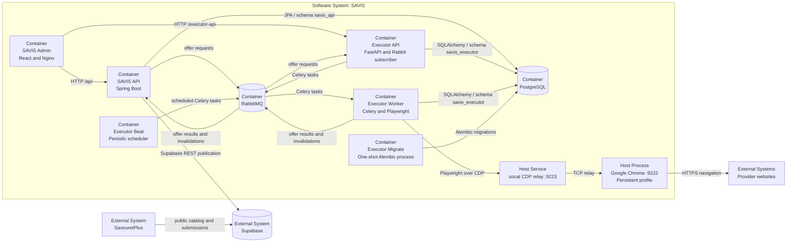

### Container Responsibilities

| Container or process | Responsibility                                         | State                   |
| -------------------- | ------------------------------------------------------ | ----------------------- |
| `frontend_admin`     | Serves the SPA and proxies API traffic                 | Browser state only      |
| `backend_api`        | Runs BOM, Supply, Activity Rate, and Catalog workflows | `savis_api` schema      |
| `executor_api`       | Exposes offers/tasks and subscribes to offer requests  | `savis_executor` schema |
| `executor_worker`    | Executes slow provider collection and refresh          | `savis_executor` schema |
| `executor_beat`      | Schedules due refreshes and stale-task cleanup         | Celery schedule state   |
| `executor_migrate`   | Applies forward-only Executor migrations               | Alembic version table   |
| `postgres`           | Hosts independently owned API and Executor schemas     | Docker volume           |
| `rabbitmq`           | Carries integration messages and Celery tasks          | Durable broker data     |
| Google Chrome        | Maintains the provider-facing browser identity         | Host profile directory  |
| CDP relay            | Makes loopback Chrome CDP reachable from Docker        | None                    |

## Production Topology

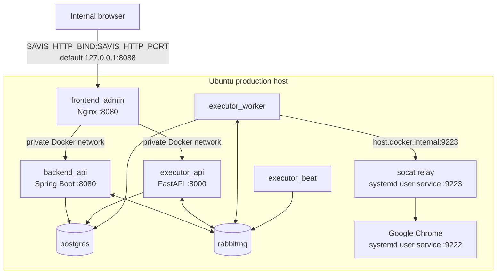

Only the Admin port is published by `docker-compose.prod.yml`. API, Executor,
PostgreSQL, and RabbitMQ remain on the private backend network.

The Admin Nginx container is the production entry point:

- `/` serves the React single-page application;
- `/api/*` proxies to `backend_api`;
- `/executor-api/*` proxies to `executor_api`;
- `/health` provides a container health endpoint.

Chrome and its relay are user-level `systemd` services owned by the graphical
desktop user. They deliberately outlive Docker deployments.

## API Components

### C4 Level 3

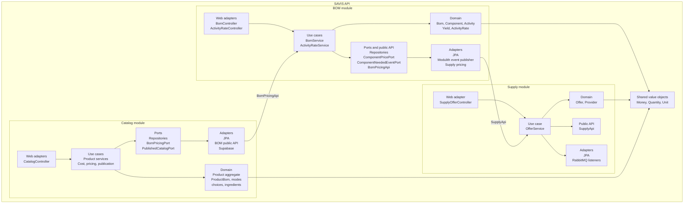

### Module Boundaries

- BOM consumes offer prices through `SupplyApi`.
- Catalog consumes BOM cost and yield through `BomPricingApi`.
- Catalog stores BOM UUID values, not JPA relationships to BOM entities.
- `common` contains shared value objects, not workflow orchestration.
- HTTP, JPA, RabbitMQ, and Supabase dependencies remain in adapters.

`SavisApiModularityTests` uses Spring Modulith to verify module dependencies and
generate module documentation snippets.

### Pricing Boundary

```text
Catalog use case
  -> BomPricingPort
  -> BomPricingAdapter
  -> BomPricingApi
  -> BomService
  -> ComponentPricePort
  -> ComponentPriceAdapter
  -> SupplyApi
```

This path keeps Catalog independent from BOM and Supply persistence while still
allowing synchronous in-process pricing.

## Executor Components

### C4 Level 3

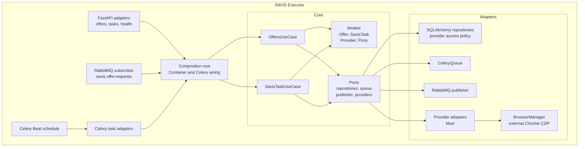

### Execution Rules

- Core models and use cases are provider-neutral.
- API routes and subscriber callbacks validate, persist, and enqueue.
- The worker performs browser navigation.
- One worker process with concurrency `1` controls the shared Chrome profile.
- `BrowserManager` opens one page per operation and disconnects without
  terminating Chrome.
- Provider adapters own selectors, parsing, block detection, and normalized
  offer conversion.
- `ReportingTask` records final Celery failures in SAVIS task persistence.

### Failure Classification

| Failure                        | Celery behavior                                             |
| ------------------------------ | ----------------------------------------------------------- |
| Unexpected transient exception | Retry with backoff, maximum 3 retries                       |
| Provider block or open circuit | Fail without immediate retry                                |
| Chrome CDP unavailable         | Fail without immediate retry                                |
| 30-minute task limit reached   | Worker terminates the task; stale cleanup provides recovery |

Immediate retries are avoided when the provider or browser state cannot improve
within the same task attempt.

## Admin Components

### C4 Level 3

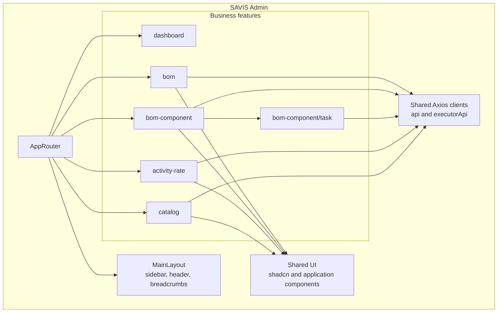

| Client        | Default production path | Target         |
| ------------- | ----------------------- | -------------- |
| `api`         | `/api`                  | SAVIS API      |
| `executorApi` | `/executor-api`         | SAVIS Executor |

The dashboard currently demonstrates the application shell with static data.
It is not yet an operational read model.

## Runtime Flows

### Activity Rate Configuration

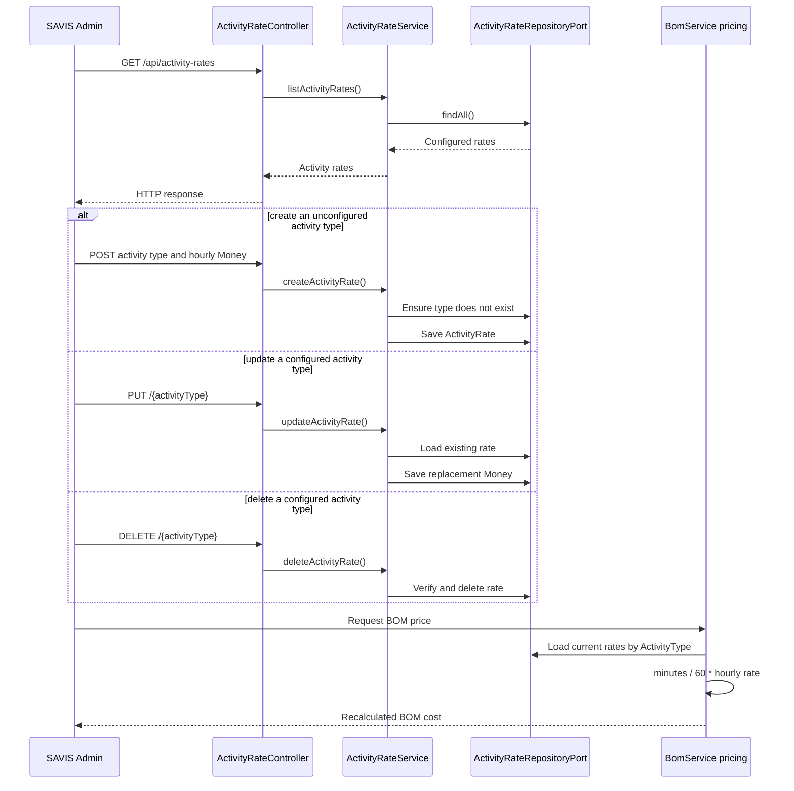

Activities store only their type and duration. Rates are global and are read
when a BOM is priced, so a configuration change affects subsequent
calculations without modifying existing BOM activities. A missing rate
currently contributes zero.

### Manual Offer Retrieval

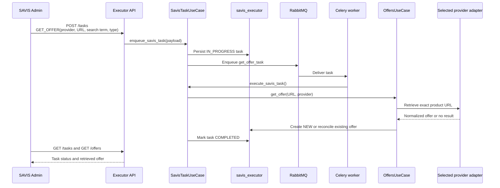

Manual retrieval targets one exact provider URL and does not run the
all-provider coverage check used by automatic `GET_OFFERS` collection. Queueing
failure marks the persisted task failed; execution failures follow the retry
flow described below.

Manual retrieval is the preferred acquisition path when the operator knows the
exact provider product URL. It is more precise and avoids broad provider search
results.

### BOM Creation and Automatic Offer Collection

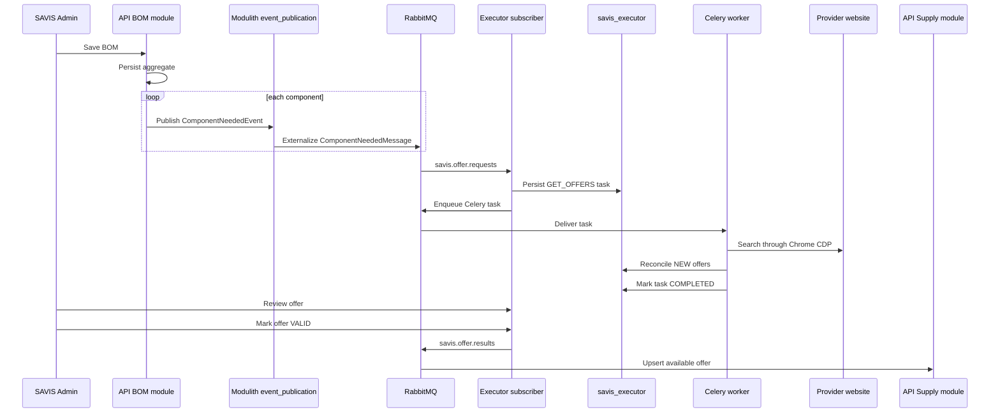

Automatic collection is a secondary coverage mechanism for BOM components
without a known product URL. It is skipped when all configured providers
already have offers for the requested search term and type.

### Review, Invalidate, and Delete an Offer

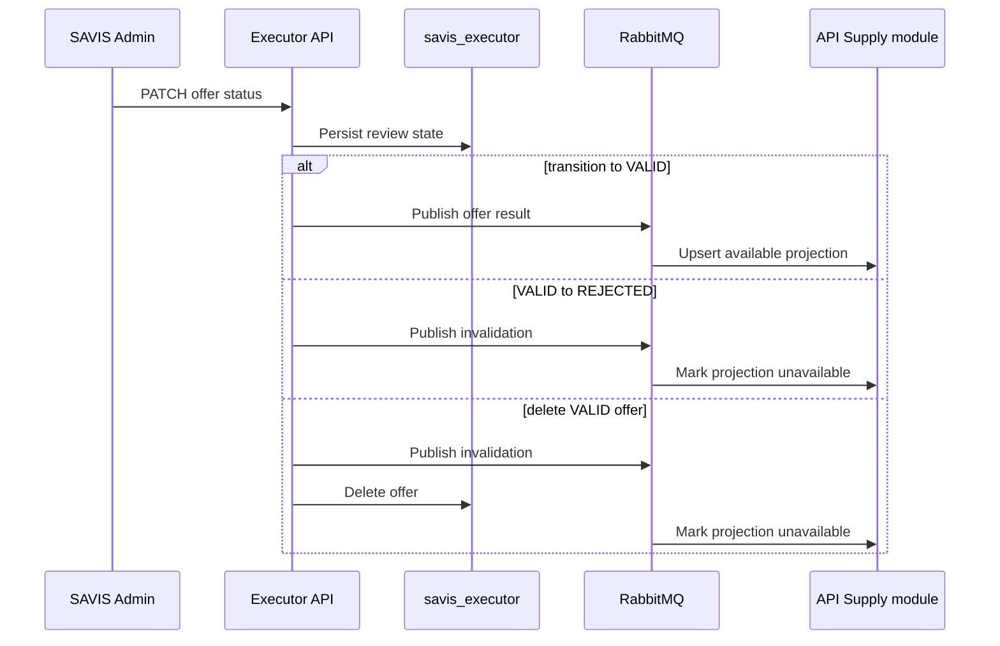

The Executor owns review history and refresh settings. The API stores only the
available offer projection required by BOM pricing.

### Scheduled Refresh and Provider Protection

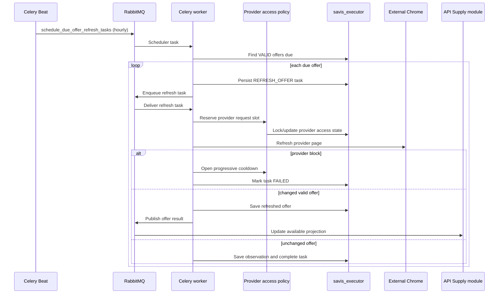

Navigation starts are spaced between 1 and 10 minutes by default. Consecutive
blocks open the circuit for 15 minutes, 1 hour, 6 hours, then 24 hours. After a
cooldown, one recovery probe is reserved.

Celery Beat also marks tasks still `IN_PROGRESS` after two hours as failed. The
cleanup runs every 15 minutes.

### Executor Retry and Scheduling

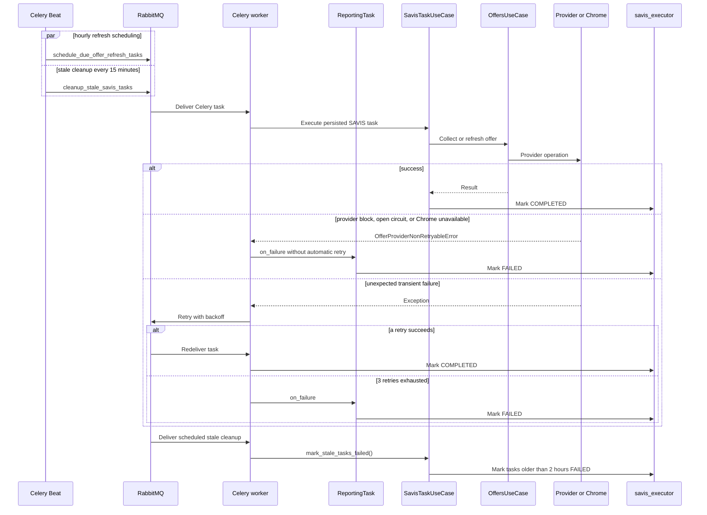

Celery enforces a 30-minute hard task limit, worker prefetch `1`, concurrency
`1`, and at most 10 tasks per child process. Retry policy and stale cleanup are
complementary: retries handle transient execution failures, while cleanup
recovers persisted tasks whose worker never reported a terminal state.

### Catalog Product Management

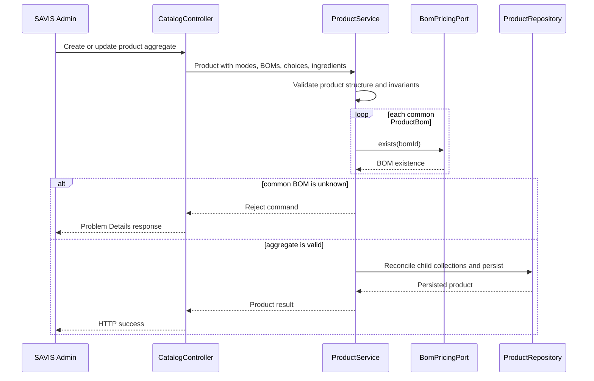

Common `ProductBom` references must resolve when a product is saved. Choice and
ingredient BOM references remain optional; unresolved optional references make
pricing analysis incomplete rather than blocking product management.

### Catalog Pricing

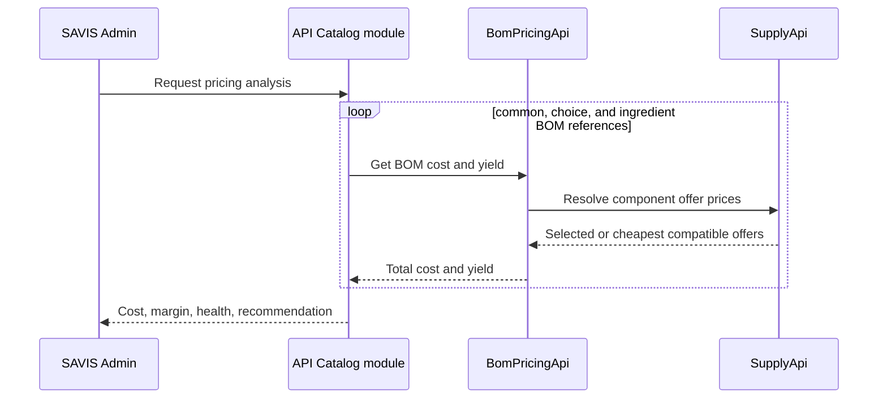

Pricing recommendations are advisory and never mutate sale prices. Missing or
non-calculable BOM references produce an `INCOMPLETE` result.

### Catalog Publication

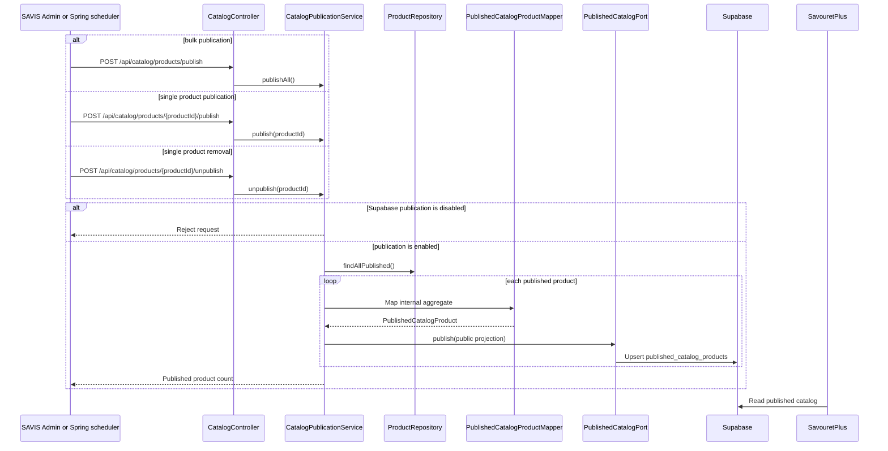

The public projection excludes common `productBoms`, internal costs,
target-margin data, diagnostics, and recommended prices. Publishing one product
that is no longer marked `published` removes its public projection. The current
HTTP endpoint calls only bulk publication, which processes products still
marked for publication and therefore does not reconcile newly unpublished
records by itself.

### Flow Review Checklist

| Flow                       | Questions for the next iteration                                                               |
| -------------------------- | ---------------------------------------------------------------------------------------------- |
| Activity rates             | Should rate changes be versioned or effective-dated for historical cost reproducibility?       |
| Manual offer retrieval     | Should operators be able to cancel, retry, or resume a failed task from the Admin?             |
| Automatic offer collection | Should duplicate component events have an explicit idempotency key or acquisition window?      |
| Offer review               | Should review transitions record the operator, reason, and audit timestamp?                    |
| Scheduled refresh          | Should per-provider schedules and concurrency limits be configurable independently?            |
| Retry and scheduling       | Should failed integration messages use a dead-letter queue and an operator replay workflow?    |
| Product management         | Should optional choice and ingredient BOMs be validated earlier with non-blocking diagnostics? |
| Catalog pricing            | Should stored pricing snapshots preserve the assumptions used for a recommendation?            |
| Catalog publication        | Should bulk publication reconcile deletions and newly unpublished products in Supabase?        |

## Data Ownership

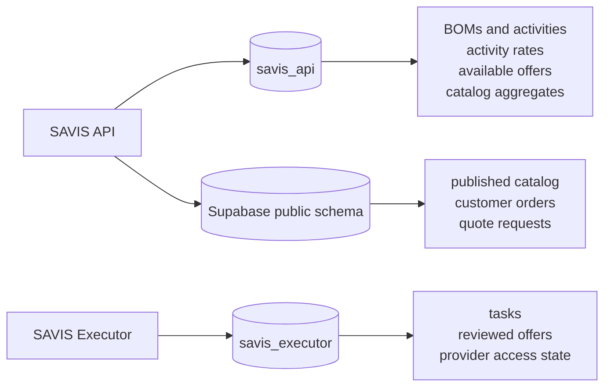

| Owner          | Migration mechanism                                      | Runtime policy                      |
| -------------- | -------------------------------------------------------- | ----------------------------------- |
| SAVIS API      | Flyway under `savis-api/src/main/resources/db/migration` | Hibernate `ddl-auto=validate`       |
| SAVIS Executor | Alembic under `savis-executor/alembic/versions`          | Explicit `executor_migrate` process |
| Supabase       | SQL under `supabase/migrations`                          | Applied by Supabase CLI             |

API tests use H2 in PostgreSQL compatibility mode with
`ddl-auto=create-drop`; Flyway is disabled in that test profile.

Executor downgrades are intentionally unsupported. Production migrations are
forward-only.

### Cross-Boundary Identifiers

- Public UUIDs cross HTTP, messaging, and module boundaries.
- Internal database identity columns remain private to their owning schema.
- Catalog BOM references are UUID values without database foreign keys to BOM
  tables.
- Executor and API offer records form separate models connected by published
  identifiers, not shared tables.

## Messaging

### Integration Queues

| Queue                       | Producer       | Consumer                | Purpose                                   |
| --------------------------- | -------------- | ----------------------- | ----------------------------------------- |
| `savis.offer.requests`      | API BOM module | Executor API subscriber | Request offer acquisition                 |
| `savis.offer.results`       | Executor       | API Supply module       | Publish valid or refreshed offers         |
| `savis.offer.invalidations` | Executor       | API Supply module       | Remove an offer from pricing availability |

All three are durable classic queues. Executor result and invalidation messages
use persistent delivery.

The Executor subscriber:

- uses manual acknowledgements;
- sets prefetch to `1`;
- acknowledges only after task enqueueing succeeds;
- rejects failed messages with `requeue=false`;
- reconnects after broker failures.

The API Supply listeners also disable requeue for rejected messages.

Celery uses the same RabbitMQ instance but its task queues are an internal
Executor concern, not integration contracts.

### Delivery Semantics

Messaging is effectively at-least-once at system boundaries. Consumers must be
idempotent:

- API offers reconcile by public UUID and provider identity;
- Executor offers reconcile by `(provider_identifier, external_id)`;
- invalidation changes availability instead of relying on physical deletion.

A dead-letter strategy for rejected integration messages is not yet
implemented.

## Operational Characteristics

### Health Model

| Component  | Endpoint or check                          | Meaning                                    |
| ---------- | ------------------------------------------ | ------------------------------------------ |
| API        | `/actuator/health/readiness`               | Spring readiness and required dependencies |
| Executor   | `/health`                                  | PostgreSQL and RabbitMQ are reachable      |
| Executor   | `/health/live`                             | HTTP process is alive                      |
| Admin      | `/health`                                  | Nginx is serving                           |
| PostgreSQL | `pg_isready`                               | Database accepts connections               |
| RabbitMQ   | `rabbitmq-diagnostics ping`                | Broker node responds                       |
| Chrome     | `/json/version` on ports `9222` and `9223` | Browser and Docker relay are reachable     |

Production deployment fails when API, Executor, or Admin does not expose a
healthy Docker status. Failure diagnostics include container logs and recent
health-check output.

### Concurrency and Backpressure

- Celery worker concurrency is `1`.
- Worker prefetch is `1`.
- Each child process handles at most 10 tasks.
- Provider access state is persisted in PostgreSQL for coordination across
  tasks and restarts.
- Celery tasks have a 30-minute hard time limit.

These settings favor provider safety and deterministic browser use over
throughput.

### Security Boundaries

- Production publishes only the Admin port.
- Database and broker credentials come from external environment files.
- Supabase writes use the service-role key only inside the API.
- Supabase RLS controls public catalog reads and customer submissions.
- Chrome relay port `9223` must be blocked from the public network.
- The Admin browser never writes directly to Supabase.

## Delivery Architecture

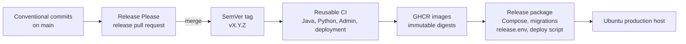

The release workflow:

1. checks out the tagged commit and verifies it belongs to `main`;
2. runs the reusable CI workflow;
3. builds API, Admin, and Executor images;
4. publishes version and source-SHA tags to GHCR;
5. records immutable image digests, SBOMs, and BuildKit provenance;
6. packages `docker-compose.prod.yml`, the deployment script, Supabase migrations,
   and `release.env`;
7. attaches the archive and SHA-256 checksum to the GitHub Release.

The production deployment script:

1. validates the environment, release metadata, image digest format, and disk
   space;
2. verifies Chrome and the relay;
3. backs up the existing PostgreSQL database;
4. pulls immutable images;
5. applies Supabase migrations when enabled;
6. runs Alembic before starting Executor processes;
7. starts API and Executor API and waits for readiness;
8. starts worker, Beat, and Admin;
9. waits for Admin health before updating the `current` symlink.

Flyway runs as part of API startup before API readiness succeeds.

## Architectural Rules

1. Keep domain and core models independent from frameworks.
2. Keep cross-module Java dependencies behind named public APIs or ports.
3. Keep provider code behind Executor `OfferProvider` adapters.
4. Keep provider HTML, selectors, and parsing out of Java.
5. Keep the host browser lifecycle outside Celery and Docker.
6. Do not run more than one worker process against the shared Chrome profile.
7. Do not perform provider collection inside HTTP handlers or RabbitMQ
   callbacks.
8. Keep Java as owner of business state and Python as owner of acquisition
   state.
9. Keep schemas independently migrated and never let one service modify
   another service's tables.
10. Keep Catalog-to-BOM references as UUIDs and avoid JPA relationships across
    module boundaries.
11. Design message consumers for duplicate delivery.
12. Keep pricing recommendations advisory.
13. Keep Supabase as a projection, not a source of internal truth.
14. Require health checks before promoting a production release.

## Known Constraints

- Maxi is currently the only configured provider adapter.
- The dashboard is static and is not an operational read model.
- RabbitMQ integration messages do not yet have a dead-letter queue.
- One shared browser profile limits scraping throughput.
- Chrome requires an active graphical Ubuntu session with `DISPLAY=:0` unless
  the installed user service is customized.
- Production deployment is automated by the packaged script, but the
  repository does not currently contain a dedicated deployment workflow.
- Bulk catalog publication does not currently remove projections for products
  that were changed from published to unpublished; use single-product removal
  to reconcile those projections.
- Customer orders and quote requests exist in Supabase but are not yet managed
  by SAVIS business modules.
